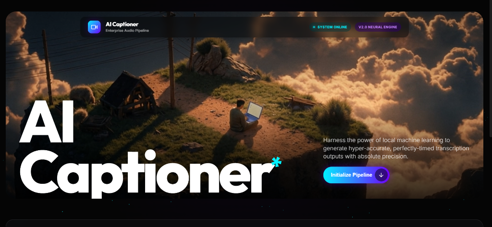
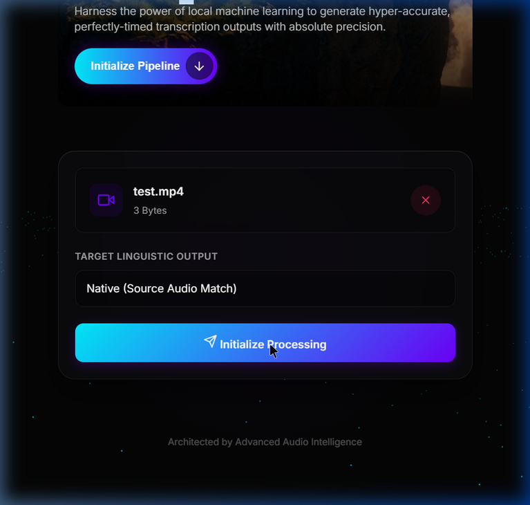
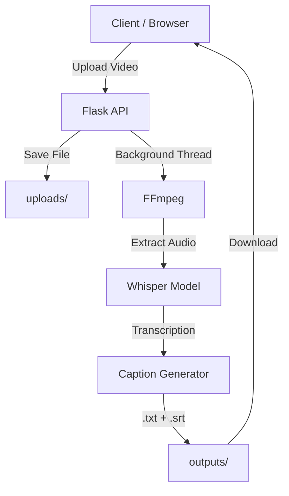

# 🎥 AI Captioner — Automated Video Transcription System

### Platform Overview


### Neural Processing Interface


> Containerized AI-powered video captioning using **OpenAI Whisper** — zero cloud cost, fully local ML pipeline.

[](https://python.org)
[](https://flask.palletsprojects.com)
[](https://docker.com)
[](LICENSE)

---

## ✨ Features

- 🎙 **Automatic Speech-to-Text** — Powered by OpenAI Whisper
- 📝 **Dual Output** — Plain text transcript + SRT subtitle files
- 🌐 **Web Interface** — Premium drag-and-drop UI with real-time progress
- 🔌 **REST API** — Upload, check status, and download via API
- 🐳 **Docker Ready** — One-command deployment
- 💸 **Zero Cost** — No paid APIs, fully offline ML

---

## 🏗 Architecture

```
Client Upload → Flask API → Save Video
      ↓
FFmpeg (audio extraction)
      ↓
Whisper Model (transcription)
      ↓
Caption Generator (TXT + SRT)
      ↓
Download via API / Web UI
```



---

## 🚀 Quick Start

### Option 1: Docker (Recommended)

```bash
# Clone the repo
git clone https://github.com/yourusername/ai-captioning.git
cd ai-captioning

# Build and run
docker-compose up --build

# Open http://localhost:5000
```

### Option 2: Local Setup

```bash
# Prerequisites: Python 3.10+, FFmpeg installed

# Install dependencies
pip install -r requirements.txt

# Run
python app.py

# Open http://localhost:5000
```

---

## 📡 API Reference

### Upload Video

```bash
POST /upload
Content-Type: multipart/form-data

curl -X POST -F "video=@myvideo.mp4" http://localhost:5000/upload
```

**Response (202):**
```json
{
  "message": "Video uploaded successfully. Transcription started.",
  "job_id": "abc-123-def",
  "filename": "myvideo.mp4",
  "file_size": 15728640
}
```

### Check Status

```bash
GET /status/<job_id>
```

**Response:**
```json
{
  "id": "abc-123-def",
  "status": "completed",
  "result": {
    "transcript": "Hello world...",
    "language": "en",
    "segments": 12,
    "files": {
      "txt": "myvideo_abc12345.txt",
      "srt": "myvideo_abc12345.srt"
    }
  }
}
```

### Download Caption File

```bash
GET /download/<filename>
```

### List All Jobs

```bash
GET /jobs
```

---

## 📁 Project Structure

```
ai-captioning/
├── app.py                  # Flask API server
├── transcriber.py          # Whisper transcription engine
├── caption_generator.py    # TXT/SRT caption formatter
├── requirements.txt        # Python dependencies
├── Dockerfile              # Container build file
├── docker-compose.yml      # Docker orchestration
├── templates/
│   └── index.html          # Web UI
├── static/
│   ├── style.css           # UI styles
│   └── script.js           # Frontend logic
├── uploads/                # Uploaded videos (temp)
└── outputs/                # Generated captions
```

---

## ⚙️ Configuration

| Variable        | Default | Description                                    |
| --------------- | ------- | ---------------------------------------------- |
| Model Size      | `base`  | Whisper model: tiny, base, small, medium, large |
| Max Upload Size | 500 MB  | Maximum video file size                        |
| Port            | 5000    | Server port                                    |

---

## 🧠 Tech Stack

| Component        | Technology         |
| ---------------- | ------------------ |
| Backend          | Flask 3.x          |
| ML Model         | OpenAI Whisper     |
| Audio Processing | FFmpeg             |
| Container        | Docker             |
| Frontend         | Vanilla HTML/CSS/JS |
| Language         | Python 3.10+       |

---

## 📋 Supported Formats

MP4, AVI, MOV, MKV, WebM, FLV, WMV, M4V

---

## 🔮 Roadmap

- [ ] Speaker diarization (who spoke what)
- [ ] Batch processing support
- [ ] Cloud deployment (Cloud Run / Railway)
- [ ] Search over transcripts
- [ ] Multi-language UI

---

## 📄 License

MIT License — see [LICENSE](LICENSE) for details.

---

> **Resume Line:** *Developed a containerized AI video captioning system using Flask and Whisper, enabling automated speech-to-text transcription and caption generation with zero cloud cost.*
